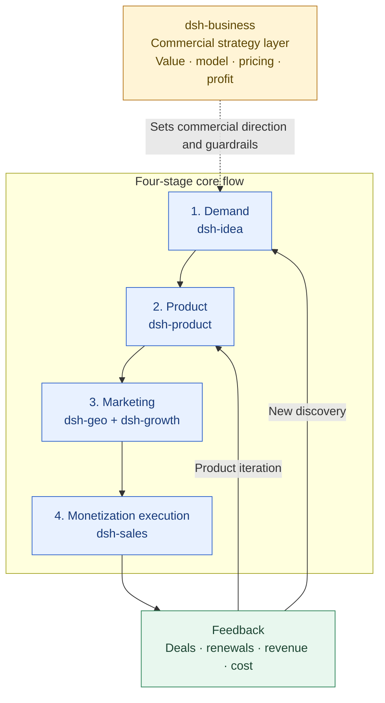

# dsh-sales

English | [中文](./README.zh.md)

`dsh-sales` 是一个 DeepSeek Harness 插件，负责把已经确认的客户机会推进到可成交、可复盘、可预测和可扩张的销售运营层。

`dsh-sales` is a DeepSeek Harness plugin for the commercial operating layer between qualified demand and repeatable revenue.

It turns local Markdown, CSV, JSON and JSONL sales material into explainable sales readiness checks, pipeline analysis, deal qualification, offer reviews, weighted forecasts and previewable sales artifacts.

## Scope

```text
ICP / value proof → qualification → opportunity stages → proposal → negotiation → close → expansion / renewal
```

The plugin is complementary to the other local plugins:

- `dsh-idea` owns external opportunity and demand discovery.
- `dsh-product` owns product definition, delivery gates, PMF evidence and growth handoff.
- `dsh-business` owns the cross-cutting commercial strategy: value, business model, pricing, packaging and profitability.
- `dsh-growth` and `dsh-geo` own the marketing stage: acquisition, activation, content and discoverability.
- `dsh-sales` owns monetization execution: qualification, deal progression, closing and commercial follow-through.

## Plugin Positioning and Collaboration Navigation

`dsh-sales` is the monetization-execution layer in the six-plugin system. It turns a clear ICP, product value and offer rules into auditable opportunities, closes, expansions and renewals.

- **Owns:** Sales readiness, qualification, opportunity stages, progression plans, proposal/offer reviews, negotiation boundaries, weighted forecasts, close reviews and revenue expansion.
- **Inputs:** Value proof and delivery boundaries from [dsh-product](../dsh-product/README.md), packaging/pricing/discount rules from [dsh-business](../dsh-business/README.md), and target-user hypotheses from [dsh-idea](../dsh-idea/README.md).
- **Outputs:** Qualification cards, deal progression plans, offer and risk checks, forecasts, loss reasons and renewal/expansion feedback for [dsh-growth](../dsh-growth/README.md) and the commercial/product teams.
- **Does not own:** CRM writes, prospect contact, message sending, quote submission or discount approval. It does not replace product, pricing or growth strategy.

## Positioning Architecture: Commercial Strategy Layer + Four-Stage Core Flow

The six plugins work together to turn a real demand signal into a deliverable product, reach target customers through marketing, and use monetization results to drive product iteration or discover new opportunities.



This plugin is the execution owner for the monetization stage: it turns qualified marketing demand into purchases under sustainable terms, then feeds close, loss, discount, renewal and unmet-need evidence to [dsh-business](../dsh-business/README.md), [dsh-product](../dsh-product/README.md) and [dsh-idea](../dsh-idea/README.md).

## Plugin Navigation

| Plugin | Clear responsibility | Direct link |
| --- | --- | --- |
| dsh-idea | External opportunities, demand signals, candidate directions and smallest useful tests | [README](../dsh-idea/README.md) |
| dsh-product | Product definition, POC/MVP, release gates and PMF | [README](../dsh-product/README.md) |
| dsh-business | Cross-cutting commercial strategy, value, pricing and profitability | [README](../dsh-business/README.md) |
| dsh-sales | Monetization execution: qualification, deal progression, closing, expansion and renewal (this plugin) | [README](./README.md) |
| dsh-growth | Acquisition, activation, retention, revenue analysis and growth experiments | [README](../dsh-growth/README.md) |
| dsh-geo | SEO/GEO/AEO, content production and search/answer-engine discoverability | [README](../dsh-geo/README.md) |

## Recommended Handoffs

| Output from this plugin | Hand off to | Handoff question |
| --- | --- | --- |
| Close/loss reasons, discounts, pricing objections and renewal signals | [dsh-business](../dsh-business/README.md) | Should pricing, packaging or channel rules change? |
| Customer needs, delivery risks and unmet contexts | [dsh-product](../dsh-product/README.md) | Which needs affect product value and PMF? |
| Pipeline, conversion, sales cycle and revenue outcomes | [dsh-growth](../dsh-growth/README.md) | Which sources and stages deserve growth investment? |
| Customer questions, objections and case-study material | [dsh-geo](../dsh-geo/README.md) | Which content can reduce sales education and closing cost? |

Use `sales_product_handoff_review` to validate a `product-sales-handoff` before qualification. Missing value evidence, proof points, commercial context or a customer next action keeps the handoff at `partial`/`blocked`; it must not be treated as a forecast or a deal commitment.

## Safety boundary

This plugin produces analysis, scripts, checklists and handoffs. It does not change CRM records, contact prospects, send messages, submit quotes, approve discounts or make commercial commitments.

## Development

```bash
pnpm install
pnpm typecheck
pnpm test
pnpm build
python C:\Users\winyh\.codex\skills\.system\plugin-creator\scripts\validate_plugin.py .
```
