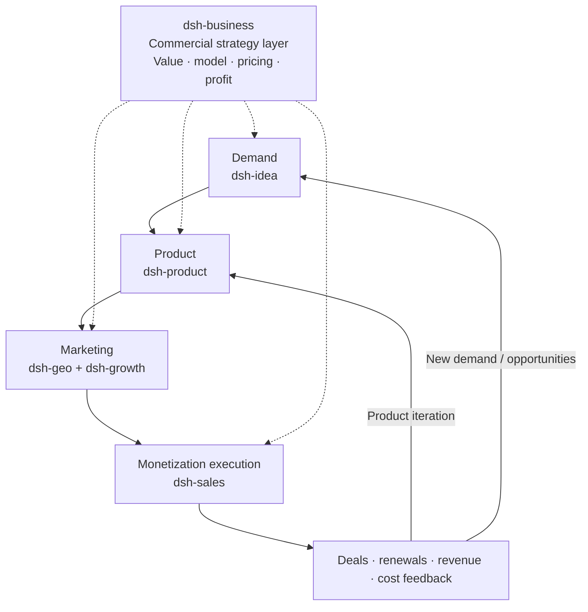

# dsh-sales

`dsh-sales` is a DeepSeek Harness plugin for the commercial operating layer between qualified demand and repeatable revenue.

It turns local Markdown, CSV, JSON and JSONL sales material into explainable sales readiness checks, pipeline analysis, deal qualification, offer reviews, weighted forecasts and previewable sales artifacts.

## Scope

```text
ICP / value proof → qualification → opportunity stages → proposal → negotiation → close → expansion / renewal
```

The plugin is complementary to the other local plugins:

- `dsh-idea` owns external opportunity and demand discovery.
- `dsh-product` owns product definition, delivery gates, PMF evidence and growth handoff.
- `dsh-business` owns the cross-cutting commercial strategy: value, business model, pricing, packaging and profitability.
- `dsh-growth` and `dsh-geo` own the marketing stage: acquisition, activation, content and discoverability.
- `dsh-sales` owns monetization execution: qualification, deal progression, closing and commercial follow-through.

## Plugin Positioning and Collaboration Navigation

`dsh-sales` is the monetization-execution layer in the six-plugin system. It turns a clear ICP, product value and offer rules into auditable opportunities, closes, expansions and renewals.

- **Owns:** Sales readiness, qualification, opportunity stages, progression plans, proposal/offer reviews, negotiation boundaries, weighted forecasts, close reviews and revenue expansion.
- **Inputs:** Value proof and delivery boundaries from [dsh-product](../dsh-product/README.md), packaging/pricing/discount rules from [dsh-business](../dsh-business/README.md), and target-user hypotheses from [dsh-idea](../dsh-idea/README.md).
- **Outputs:** Qualification cards, deal progression plans, offer and risk checks, forecasts, loss reasons and renewal/expansion feedback for [dsh-growth](../dsh-growth/README.md) and the commercial/product teams.
- **Does not own:** CRM writes, prospect contact, message sending, quote submission or discount approval. It does not replace product, pricing or growth strategy.

## Positioning Architecture: Commercial Strategy Layer + Four-Stage Core Flow

The six plugins work together to turn a real demand signal into a deliverable product, reach target customers through marketing, and use monetization results to drive product iteration or discover new opportunities.



This plugin is the execution owner for the monetization stage: it turns qualified marketing demand into purchases under sustainable terms, then feeds close, loss, discount, renewal and unmet-need evidence to [dsh-business](../dsh-business/README.md), [dsh-product](../dsh-product/README.md) and [dsh-idea](../dsh-idea/README.md).

## 插件导航

| 插件 | 清晰分工 | 直接跳转 |
| --- | --- | --- |
| dsh-idea | 外部机会、需求信号、候选方案和最小验证 | [README](../dsh-idea/README.md) |
| dsh-product | 产品定义、POC/MVP、发布门槛和 PMF | [README](../dsh-product/README.md) |
| dsh-business | 横跨全链路的商业策略、价值、定价和盈利 | [README](../dsh-business/README.md) |
| dsh-sales | 变现执行：资格判断、商机推进、成交、扩单和续约（当前插件） | [README](./README.md) |
| dsh-growth | 获客、激活、留存、收入分析和增长实验 | [README](../dsh-growth/README.md) |
| dsh-geo | SEO/GEO/AEO、内容生产和搜索/答案引擎可发现性 | [README](../dsh-geo/README.md) |

## 推荐交接

| 本插件产物 | 交给谁 | 交接问题 |
| --- | --- | --- |
| 成交/丢单原因、折扣、价格异议和续约信号 | [dsh-business](../dsh-business/README.md) | 价格、套餐或渠道规则是否需要调整？ |
| 客户需求、交付风险和未满足场景 | [dsh-product](../dsh-product/README.md) | 哪些需求影响产品价值和 PMF？ |
| 管道、转化、销售周期和收入结果 | [dsh-growth](../dsh-growth/README.md) | 哪些来源和阶段值得投入增长资源？ |
| 客户常问问题、异议和成功案例素材 | [dsh-geo](../dsh-geo/README.md) | 哪些内容可以降低教育成本并提升可发现性？ |

## Safety boundary

This plugin produces analysis, scripts, checklists and handoffs. It does not change CRM records, contact prospects, send messages, submit quotes, approve discounts or make commercial commitments.

## Development

```bash
pnpm install
pnpm typecheck
pnpm test
pnpm build
python C:\Users\winyh\.codex\skills\.system\plugin-creator\scripts\validate_plugin.py .
```
