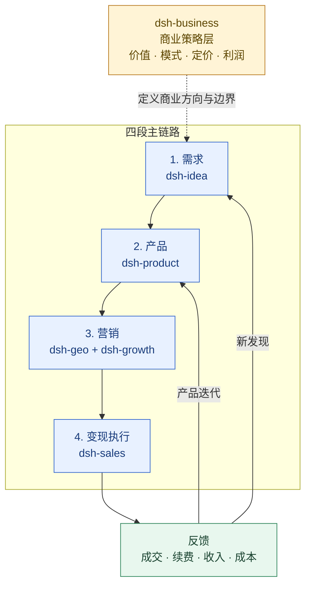

# 销售成交（dsh-sales）

中文 | [English](./README.md)

`dsh-sales` 是一个 DeepSeek Harness 插件，负责把已经确认的客户机会推进到可成交、可复盘、可预测和可扩张的销售运营层。

完整的阶段作战卡见 [`docs/销售作战手册.md`](docs/销售作战手册.md)。本插件不追求覆盖所有销售理论，默认只服务于 B2B / 高客单价、需要人工推进的销售机会。

## 方法主线

```text
ICP / 价值证据 → 资格判断 → 商机阶段 → 方案与报价 → 异议与谈判 → 成交 → 复购 / 扩单
```

## 定位架构：商业策略层 + 四段主链路



`dsh-sales` 负责变现阶段的执行，把营销带来的有效需求推进到成交、扩单和续约；成交、丢单、折扣和客户未满足需求会反馈给商业策略、产品和需求发现。

## 插件导航

| 插件 | 分工 | 直接跳转 |
|---|---|---|
| `dsh-idea` | 外部机会、需求信号、候选方案和最小验证 | [README](../dsh-idea/README.zh.md) |
| `dsh-product` | 产品定义、POC/MVP、发布门槛和 PMF | [README](../dsh-product/README.zh.md) |
| `dsh-business` | 横跨全链路的商业策略、价值、定价和盈利 | [README](../dsh-business/README.zh.md) |
| `dsh-sales` | 变现执行：资格判断、商机推进、成交、扩单和续约 | [README](./README.zh.md) |
| `dsh-growth` | 获客、激活、留存、收入分析和增长实验 | [README](../dsh-growth/README.zh.md) |
| `dsh-geo` | SEO/GEO/AEO、内容生产和搜索/答案引擎可发现性 | [README](../dsh-geo/README.zh.md) |

## 与其他插件的边界

- `dsh-idea`：发现外部机会、需求和客户问题；
- `dsh-product`：产品定义、交付 gate、PMF 证据和增长交接；
- `dsh-business`：贯穿需求、产品、营销和变现的商业策略，包括价值、模式、定价、套餐和盈利；
- `dsh-growth` 与 `dsh-geo`：营销阶段的获客、激活、内容和可发现性；
- `dsh-sales`：资格判断、销售流程、商机推进、成交、预测和复购扩单。

插件之间通过交接材料和证据引用协作，不直接读取或修改其他插件的内部状态。

使用 `sales_product_handoff_review` 接收并校验 `product-sales-handoff`。缺少价值证据、Proof points、商业上下文或客户下一动作时，交接会保持 `partial` / `blocked`，不会被当作成交预测或商业承诺。

使用 `sales_commercial_handoff_review` 在报价或谈判前校验 `dsh-business` 的 `commercial-handoff`。计算出的有效成交价不等于已批准底价，任何例外都必须回到有权限的审批流程。

## 当前版本的聚焦边界

- 不做外部批量获客；线索来自用户提供的名单、访谈记录或其他插件交接；
- 不重复做 `dsh-idea` 的外部机会发现和访谈研究；
- 不重复做 `dsh-product` 的产品定义、POC、MVP 或 PMF 判定；
- 不重复做 `dsh-business` 的价盘、贡献毛利和盈利计算；
- 不重复做 `dsh-growth` 的 CAC/LTV、收入分析和增长实验；
- 只把这些结果接入线索筛选、沟通、资格判断、报价协同、谈判计划、成交和复购/扩单信号。

## 核心能力

- `sales_onboarding`：检查销售项目准备度、方法覆盖和当前 gate；
- `sales_audit_note`：审计销售笔记或 playbook 的证据、状态和行动字段；
- `sales_funnel_analyze`：分析商机阶段、转化、流失和阶段定义；
- `sales_deal_review`：对单个机会做资格判断、风险识别和下一步规划；
- `sales_offer_review`：检查价值主张、报价证据、价格边界和商业风险；
- `sales_product_handoff_review` / `sales_commercial_handoff_review`：校验产品交接和商业交接是否达到销售推进前的最低条件；
- `sales_forecast`：基于管道金额、阶段概率和预计成交日生成加权预测；
- `sales_playbook_generate`：生成销售 playbook、客户推进计划或成交复盘；
- `sales_apply_artifact`：预览后安全写入本地 Markdown。

所有结论都区分事实、客户反馈、估计、推断和缺失证据；框架完成不等于成交概率或收入保证。

## 运行与开发

```bash
pnpm install
pnpm typecheck
pnpm test
pnpm build
python C:\Users\winyh\.codex\skills\.system\plugin-creator\scripts\validate_plugin.py .
```
